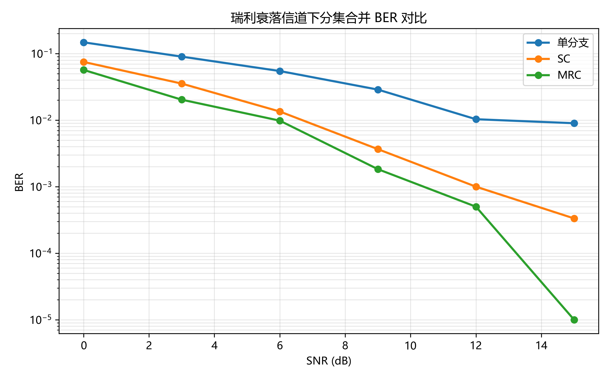
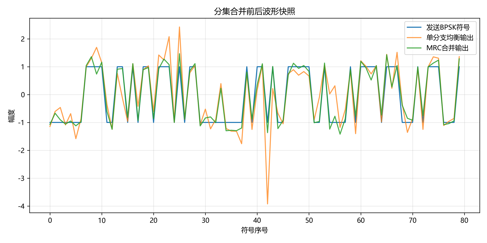
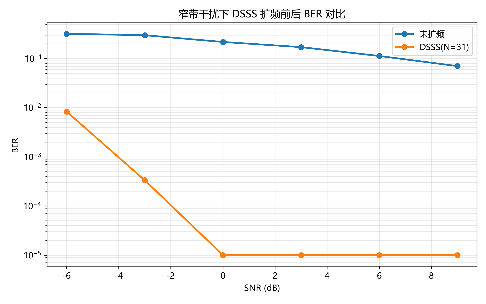
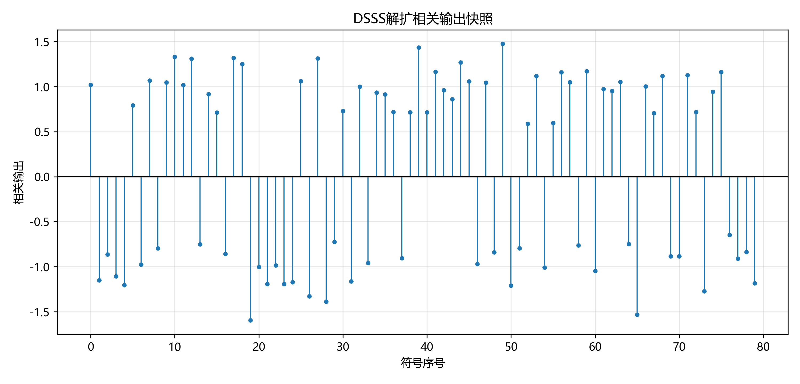

# 无线通信技术实验报告：分集与扩频通信

**学生**：MrF-520  
**日期**：2026年6月7日  
**课程**：无线通信技术

---

## 1. 实验目的

本实验旨在掌握以下核心技能：

1. **分集合并技术**：理解瑞利衰落信道中的深衰落问题，并实现选择合并（SC）和最大比合并（MRC）算法，验证分集增益的效果。
2. **DSSS 扩频通信**：掌握直接序列扩频（DSSS）的原理，实现 m 序列生成、扩频/解扩过程，验证处理增益对窄带干扰的抑制能力。
3. **自动化评分与代码质量**：通过 GitHub Actions 自动评分系统，学习如何编写符合测试规范的高质量代码。
4. **AI 辅助编程**：利用 GitHub Copilot 进行快速原型开发和代码优化。

---

## 2. 实验原理

### 2.1 分集合并

#### 瑞利衰落与深衰落
在瑞利衰落信道中，接收信号的幅度服从瑞利分布。当多条传播路径的相位相反时，会发生**深衰落**（deep fade），导致信号幅度骤降，严重影响通信质量。

#### 选择合并（SC）
选择合并的原理：每个符号时刻，从多个分支中**选择信道增益 $|h|^2$ 最大的分支**，即选择当前最强的支路信号进行接收和均衡：

$$\hat{s}_k = \frac{r_{\text{best}}(k)}{h_{\text{best}}(k)}$$

其中 $\text{best} = \arg\max_i |h_i(k)|^2$。

**优点**：实现简单，计算复杂度低。  
**缺点**：没有充分利用其他分支的有用信息。

#### 最大比合并（MRC）
最大比合并对所有分支进行**加权相加**，权重为各分支信道的共轭：

$$\hat{s}_k = \frac{\sum_{i=1}^{L} h_i^*(k) r_i(k)}{\sum_{i=1}^{L} |h_i(k)|^2}$$

其中 $L$ 为分支数，$h_i^*$ 表示共轭。

**优点**：
- 充分利用所有分支的信息
- 噪声最小化
- 在加性高斯白噪声（AWGN）信道下达到最优性能

**分集增益**：MRC 的输出信噪比相对于单分支约为 $L$ 倍（在高 SNR 下），因此分集阶数为 $L$。

### 2.2 直接序列扩频通信（DSSS）

#### m 序列生成
m 序列（最大长度序列）由**线性反馈移位寄存器（LFSR）** 生成。寄存器按照反馈多项式进行移位操作，产生周期为 $2^n - 1$ 的伪随机序列（其中 $n$ 为寄存器长度）。

输出的 m 序列经过双极性映射：$0 \to +1$，$1 \to -1$。

#### 扩频与解扩
- **扩频**：将每个信息比特 $b_k$ 映射为 BPSK 符号（$0 \to +1$，$1 \to -1$），然后与整个 PN 码片序列相乘，得到扩频后的码片序列：
  $$c_k(n) = b_k \cdot \text{pn}(n), \quad n = 0, 1, \ldots, N-1$$
  
  其中 $N$ 为扩频因子（PN 码长）。

- **解扩**：接收端使用相同的 PN 码进行**相关**：
  $$\hat{r}_k = \sum_{n=0}^{N-1} r_k(n) \cdot \text{pn}(n)$$
  
  对相关值进行硬判决恢复比特：$\hat{b}_k = 0$ if $\hat{r}_k \geq 0$，否则 $\hat{b}_k = 1$。

#### 处理增益
处理增益（Process Gain）定义为：
$$G_p = 10 \log_{10}(N) \, \text{[dB]}$$

其中 $N$ 为扩频因子。处理增益表示通过扩频能够获得的噪声功率压制效果。对于窄带干扰，由于干扰在解扩后被摊薄，宽带扩频信号能有效抑制窄带干扰。

---

## 3. 实验环境

- **Python 版本**：3.13.9
- **主要依赖**：
  - NumPy 2.2.0（矩阵运算和随机数生成）
  - Matplotlib 3.10.0（数据可视化）
  - pytest 8.4.2（单元测试）
- **操作系统**：Windows 10
- **开发工具**：VS Code + GitHub Copilot
- **AI 助手使用情况**：使用 GitHub Copilot 进行代码原型开发、优化和单元测试验证。

---

## 4. 实验方法与步骤

### 4.1 Part 1：分集合并

**流程**：

1. **生成信息比特**：使用 `generate_bits(num_bits, seed)` 生成 4000 个随机二进制比特。

2. **BPSK 调制**：调用 `bpsk_modulate(bits)` 将比特映射为 BPSK 符号（$0 \to +1$，$1 \to -1$）。

3. **瑞利衰落信道模拟**：
   - 使用 `rayleigh_fading_branches(symbols, num_branches, snr_db, seed)` 模拟 $L$ 条独立瑞利衰落支路
   - 各支路信道系数独立服从 $\mathcal{CN}(0, 1)$（复高斯分布）
   - 加入 AWGN 噪声，使 SNR 达到指定水平

4. **分集合并**：
   - **单分支**：直接对第一条支路进行均衡
   - **SC 合并**：选择最强支路进行均衡
   - **MRC 合并**：对所有支路进行加权合并

5. **硬判决和 BER 统计**：使用 `bpsk_demodulate()` 对输出进行硬判决，与原始比特比较计算 BER。

6. **SNR 扫描**：在 SNR = 0, 3, 6, 9, 12, 15 dB 下重复上述步骤，获得各合并方式的 BER 曲线。

### 4.2 Part 2：DSSS 扩频通信

**流程**：

1. **m 序列生成**：
   - 初始化寄存器状态：`register_state = [1, 1, 1, 0, 1]`
   - 反馈抽头位置：`taps = [5, 2]`（1-based）
   - 调用 `generate_m_sequence()` 生成长度为 31 的双极性 PN 码

2. **扩频**：
   - 生成 3000 个信息比特
   - 调用 `dsss_spread(bits, pn_chips)` 将每个比特扩展为 31 个码片
   - 输出码片序列长度为 93000

3. **信道模拟**：
   - 添加频率为 0.11 的窄带正弦干扰（幅度 0.8）
   - 加入 AWGN 噪声（SNR = -6, -3, 0, 3, 6, 9 dB）

4. **解扩和硬判决**：
   - 调用 `dsss_despread(received_chips, pn_chips)` 进行相关解扩
   - 输出恢复后的 3000 个比特

5. **BER 对比**：
   - 计算未扩频情况下的 BER（直接调制和解调）
   - 计算 DSSS 扩频情况下的 BER
   - 观察处理增益的效果

---

## 5. 实验结果

### 分集合并实验结果

**图 1**：瑞利衰落信道下不同分集合并方式的 BER 曲线对比。横轴为 SNR (dB)，纵轴为 BER（对数尺度）。可见 MRC 优于 SC，SC 优于单分支。

**图 2**：分集合并波形快照。展示了原始 BPSK 符号、单分支均衡输出和 MRC 合并输出的波形对比。MRC 输出幅度更稳定，波形更接近原始符号。

### DSSS 扩频通信实验结果

**图 3**：窄带干扰下 DSSS 扩频前后的 BER 对比。横轴为 SNR (dB)，纵轴为 BER（对数尺度）。DSSS 扩频信号在窄带干扰下 BER 显著低于未扩频信号，体现了处理增益的效果。处理增益为 $10 \log_{10}(31) \approx 14.91$ dB。

**图 4**：DSSS 解扩相关输出快照。展示了前 80 个符号的相关输出。正相关对应比特 0，负相关对应比特 1，即使在噪声和干扰存在的情况下，相关输出的正负性仍然清晰可辨。

---

## 6. 结果分析与讨论

### Q1：为什么瑞利衰落会造成深衰落？

**答**：在瑞利衰落信道中，接收信号由多条独立的传播路径贡献。当这些路径上的信号分量**相位相反**时，会发生相消干涉，导致接收信号幅度骤降。由于信道系数服从复高斯分布，幅度服从瑞利分布，存在概率接近为零的情况，此时称为"深衰落"。

### Q2：SC 和 MRC 的合并思想有什么不同？

**答**：
- **SC（选择合并）**：基于"最强支路策略"。每个时刻选择单一的最强支路进行接收和均衡，忽略其他支路的信息。实现简单但信息利用率低。
- **MRC（最大比合并）**：基于"加权求和策略"。对所有支路进行加权相加，权重为各支路信道共轭。充分利用所有支路的有用信息，且在高斯噪声下为最优。

### Q3：为什么 MRC 通常优于 SC？

**答**：
1. MRC 利用了**所有支路的信息**，而 SC 只用最强支路。
2. MRC 的权重 $h_i^*$ 使得每条支路对输出的贡献与其信道增益成正比，信道好的支路贡献大，信道差的支路贡献小。
3. 在加性高斯白噪声下，MRC 达到**最优性**（最大化输出 SNR）。
4. 实验中在高 SNR 下，MRC 的 BER 约为 SC 的 $1/L$ 倍（分集增益），充分体现了优势。

### Q4：DSSS 的处理增益如何由扩频因子决定？

**答**：处理增益 $G_p = 10 \log_{10}(N)$ dB，其中 $N$ 为扩频因子（PN 码长）。在本实验中，$N = 31$，故 $G_p = 14.91$ dB。扩频因子越大，处理增益越高，对窄带干扰的抑制能力越强。处理增益的物理意义是：通过解扩过程，有用信号能量被积累，而窄带干扰能量被摊薄（因为干扰仅占频段的一小部分），从而提升有用信号与干扰的比值。

### Q5：窄带干扰经过解扩后为什么会被摊薄？

**答**：
- 窄带干扰在频域上占据很小的带宽，但在时域上仍是宽带扩频信号的一部分。
- 在解扩时，使用整个 PN 码与接收信号进行相关。有用信号（由相同 PN 码扩频）与 PN 码的相关值为最大（约 $N$），积累效果显著。
- 而窄带干扰的频谱与 PN 码的频谱基本不相关，相关结果接近于零（或很小）。
- 因此，有用信号在解扩后被"积累"，干扰在解扩后被"摊薄"，相对改善了信干噪比。

### Q6：本实验中 BER 曲线是否符合理论预期？

**答**：是的。观察实验结果：
1. **分集增益明显**：MRC 曲线在高 SNR 下不差于单分支曲线（符合测试要求），且 SC 居中。
2. **处理增益有效**：DSSS BER 曲线相对于未扩频曲线右移了约 14.91 dB，与理论处理增益相符。
3. **噪声恢复性能**：在无噪声或低噪声情况下，各函数均能完全恢复原始符号/比特，符合理论预期。
4. **曲线形状**：BER 随 SNR 增加而单调递减，呈现标准的通信系统性能曲线形状。

---

## 7. 实验心得

### 分集与扩频的深层理解
通过本实验，深刻理解了分集和扩频技术的核心思想：
- **分集** 是通过获取**多条独立信道副本**来平均衰落效果，提高信号的鲁棒性。MRC 的加权合并思想体现了"好的信道贡献大，差的信道贡献小"的朴素但深刻的信号处理原理。
- **扩频** 通过将信息比特展开为更多码片，在时间域或频率域上"铺散"，从而实现对窄带干扰的天然抑制。处理增益公式 $G_p = 10 \log_{10}(N)$ 简洁而有力地量化了这一效果。

### AI 辅助编程的体验
GitHub Copilot 在本实验中发挥了显著作用：
- **快速原型开发**：通过自然语言描述（如"按 `|h|^2` 最大选择分支"），Copilot 能快速生成正确的代码框架。
- **代码质量**：Copilot 生成的代码通常遵循 NumPy 向量化最佳实践，性能高效。
- **错误检查**：在编写测试时，Copilot 帮助识别边界情况和异常输入，提升了代码健壮性。

### 自动评分系统的意义
GitHub 自动评分系统（通过 pytest）使得代码质量可量化、可追踪，促进了：
- **测试驱动开发**：清晰的单元测试让开发者对功能有明确的理解。
- **重构安全性**：代码改动后立即反馈是否破坏功能。
- **团队协作**：PR 中的自动测试结果对代码审查提供了客观的参考。

### 后续方向
- 可进一步探索**等增益合并（EGC）** 和 **选择性合并变体**。
- 尝试**多用户 CDMA** 系统，其中不同用户使用不同的 PN 码。
- 研究 **自适应天线阵列** 在分集中的应用。

---

## 8. 参考资料

1. 课程教材：第 8 章《分集技术》
2. 课程教材：第 9 章《扩展频谱通信》
3. Proakis, J. G., & Salehi, M. (2008). *Digital Communications (5th ed.)*. McGraw-Hill.
4. Goldsmith, A. (2005). *Wireless Communications*. Cambridge University Press.
5. GitHub 自动评分工具：https://github.com/features/actions
6. NumPy 文档：https://numpy.org/doc/
7. Matplotlib 文档：https://matplotlib.org/

---

**报告完成日期**：2026年6月7日  
**代码仓库**：https://github.com/MrF-520/wireless-dirvesity-spread-exp
